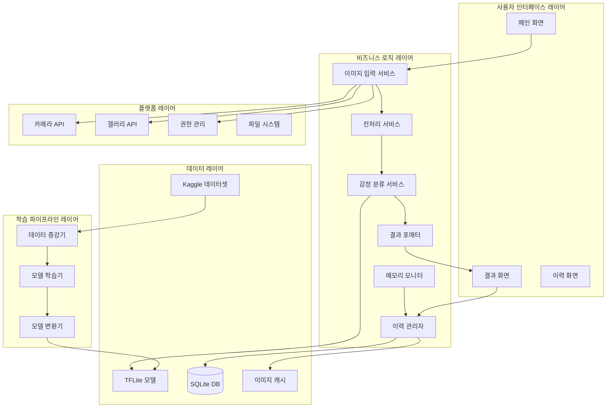
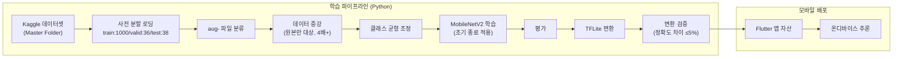
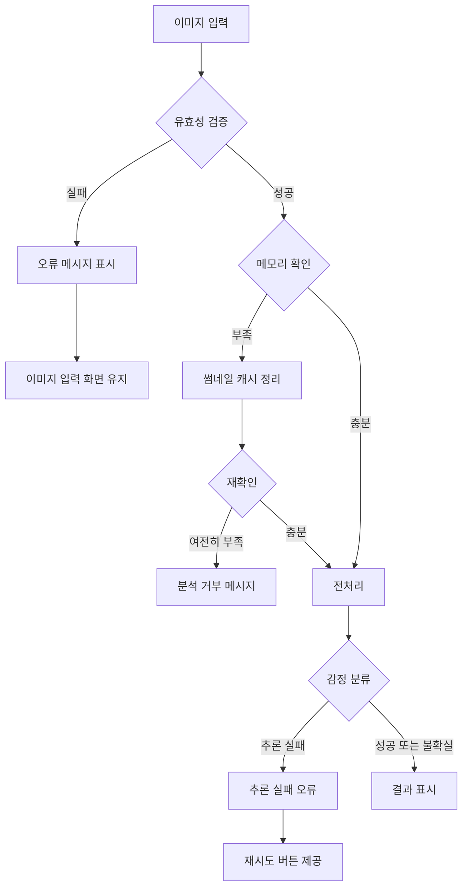

# 기술 설계 문서: 동물 감정 인식 (Animal Emotion Recognition)

## Overview

본 문서는 Kaggle "Pets Facial Expression Dataset" 기반의 딥러닝 모델을 활용하여 동물 이미지에서 감정 상태를 한국어로 표현하는 모바일 애플리케이션의 기술 설계를 정의한다. 해당 데이터셋은 소규모(총 약 1,074장)이므로 데이터 증강 전략을 적극 활용한다. 앱은 별도의 동물 감지 또는 동물 종 분류 모델을 포함하지 않으며, 데이터셋 분포 밖 입력은 감정 분류 신뢰도와 불확실 판정으로 한계를 표시한다.

### 핵심 설계 결정

| 결정 사항 | 선택 | 근거 |
|-----------|------|------|
| 모바일 프레임워크 | Flutter | Android/iOS 크로스 플랫폼 지원, TFLite 통합 생태계 |
| 딥러닝 모델 | MobileNetV2 (전이 학습) | 모바일 최적화 아키텍처, 경량화, 소규모 데이터셋에 효과적 |
| 모델 배포 형식 | TensorFlow Lite | Flutter 공식 지원, 온디바이스 추론 최적화 |
| 상태 관리 | Riverpod | 테스트 용이성, 의존성 주입, 비동기 처리 |
| 로컬 저장소 | SQLite + Hive | 이력 관리(SQLite), 설정/캐시(Hive) |
| 데이터 증강 | Keras ImageDataGenerator + 커스텀 파이프라인 | 소규모 데이터셋 보완, 4배 이상 확장 |
| 비대상 이미지 처리 | 별도 거부 없음 + 불확실 판정 | 동물 감지 모델은 범위 제외, 모든 유효 이미지는 4개 감정 분류 흐름으로 처리 |

### 주요 리서치 결과

1. **모델 아키텍처**: MobileNetV2는 역잔차 구조(inverted residual)와 경량 깊이별 분리 합성곱(depthwise separable convolution)을 사용하여 모바일 환경에서 효율적인 추론이 가능하다. ([출처: arxiv.org/abs/1801.04381](https://arxiv.org/abs/1801.04381))
2. **Flutter + TFLite 통합**: `tflite_flutter` 패키지(pub.dev)가 TFLite C API에 직접 바인딩하여 저지연 추론을 지원한다. 이미지 분류, 객체 감지 등을 로컬에서 수행할 수 있다.
3. **소규모 데이터셋 학습 전략**: 전이 학습과 데이터 증강을 결합하면 1,000장 수준의 소규모 데이터셋에서도 효과적인 분류 모델을 학습할 수 있다. 조기 종료(early stopping)로 과적합을 방지한다.
4. **데이터셋 정보**: Kaggle "Pets Facial Expression Dataset"은 4개 감정 카테고리(Angry, Happy, Sad, Other)로 분류된 이미지를 포함하며, Master Folder에 train(1,000장)/valid(36장)/test(38장)로 사전 분할되어 있다. ([출처: kaggle.com/datasets/anshtanwar/pets-facial-expression-dataset](https://www.kaggle.com/datasets/anshtanwar/pets-facial-expression-dataset))

---

## Architecture

### 시스템 아키텍처 다이어그램



### 모델 학습 및 배포 파이프라인



### 레이어 구조

| 레이어 | 책임 | 주요 기술 |
|--------|------|-----------|
| 프레젠테이션 | UI 렌더링, 사용자 상호작용 | Flutter Widget, Riverpod |
| 도메인 | 비즈니스 규칙, 유스케이스 | Dart 순수 클래스 |
| 데이터 | 모델 추론, 저장소, 캐시 | TFLite, SQLite, Hive |
| 인프라 | 플랫폼 API 접근 | image_picker, permission_handler |
| 학습 | 데이터 증강, 모델 학습/변환 | Python, TensorFlow/Keras |

---

## UX and Screen State Design

### 시각 방향

- **목적**: 사용자가 반려동물 사진을 넣고 분석 결과를 빠르게 이해하도록 돕는다.
- **톤**: 따뜻하지만 과장하지 않는 모바일 진단 도구. 결과는 단정 대신 신뢰도를 함께 보여준다.
- **구성 원칙**: 메인 화면은 촬영/갤러리 두 행동을 중심에 두고, 결과 화면은 이미지와 감정 문장을 먼저 보여준 뒤 신뢰도와 세부 예측을 보조 정보로 배치한다.
- **표현 원칙**: 비대상_이미지 또는 낮은 신뢰도에서는 감정을 단정하지 않고 불확실 안내 문구와 상위 후보를 표시한다.

### 화면 상태 계약

| 상태 | 진입 조건 | 필수 UI 요소 | 주요 행동 |
|------|-----------|--------------|-----------|
| 메인 준비 | 앱 최초 실행 또는 분석 종료 후 복귀 | 카메라 촬영 버튼, 갤러리 선택 버튼, 이력 진입 버튼, 지원 입력 조건 안내 | 촬영, 갤러리 선택, 이력 보기 |
| 권한 안내 | 카메라/갤러리 권한 거부 | 권한 필요 메시지, 설정 이동 버튼, 메인 복귀 버튼 | 설정 열기, 메인 복귀 |
| 분석 중 | 유효 이미지 입력 후 전처리/추론 진행 | 입력 이미지 미리보기, 로딩 인디케이터, 진행 중 문구 | 취소 없이 완료 또는 오류 대기 |
| 일반 결과 | 최상위 신뢰도 50% 이상 | 입력 이미지, 감정 이모지, 감정 카테고리, 정수 신뢰도, 한국어 결과 문장 | 다시 분석, 이력 보기 |
| 불확실 결과 | 최상위 신뢰도 50% 미만 | 입력 이미지, 불확실 안내 문구, 상위 3개 감정 후보 목록, 각 후보 신뢰도 | 다시 분석, 이력 보기 |
| 오류 | 유효성 검증 실패, 추론 실패, 메모리 부족 | 오류 메시지, 재시도 버튼 또는 메인 복귀 버튼 | 재시도, 메인 복귀 |
| 이력 목록 | 저장된 분석 이력 1건 이상 | 최신순 이력 목록, 썸네일 또는 대체 썸네일, 카테고리, 신뢰도, 분석 일시 | 이력 확인, 메인 복귀 |
| 빈 이력 | 저장된 분석 이력 없음 | 빈 상태 메시지, 분석 시작 버튼 | 메인 복귀 또는 분석 시작 |
| 캐시 정리 알림 | 메모리 압박으로 썸네일_캐시 정리 완료 | 캐시 정리 안내, 분석 계속 가능 여부 | 확인 |

### 접근성 및 반응형 규칙

- 주요 버튼의 터치 영역은 최소 44x44dp 이상이어야 한다.
- 핵심 텍스트와 배경 대비는 WCAG AA 기준(일반 텍스트 4.5:1 이상)을 만족해야 한다.
- 결과 문장, 오류 문구, 날짜 텍스트는 시스템 글자 크기 확대에서도 부모 영역 밖으로 넘치지 않아야 한다.
- 모든 이미지 기반 결과에는 스크린 리더용 대체 설명을 제공한다.

---

## Components and Interfaces

### 1. 이미지 입력 서비스 (ImageInputService)

```dart
/// 이미지 입력 처리를 담당하는 서비스
abstract class ImageInputService {
  /// 카메라로부터 이미지를 캡처한다
  /// [ImageInputResult]를 반환하며, 취소 시 null을 반환
  Future<ImageInputResult?> captureFromCamera();

  /// 갤러리에서 이미지를 선택한다
  /// [ImageInputResult]를 반환하며, 취소 시 null을 반환
  Future<ImageInputResult?> pickFromGallery();

  /// 이미지 유효성을 검증한다
  /// 형식, 크기, 해상도 검증 수행
  ValidationResult validateImage(File imageFile);
}

/// 이미지 입력 결과
class ImageInputResult {
  final File imageFile;
  final ImageMetadata metadata;

  const ImageInputResult({required this.imageFile, required this.metadata});
}

/// 이미지 유효성 검증 결과
sealed class ValidationResult {
  const ValidationResult();
}

class ValidationSuccess extends ValidationResult {
  const ValidationSuccess();
}

class ValidationFailure extends ValidationResult {
  final ValidationErrorType errorType;
  final String message;

  const ValidationFailure({required this.errorType, required this.message});
}

/// 유효성 검증 오류 유형
enum ValidationErrorType {
  unsupportedFormat,  // 지원하지 않는 형식
  fileSizeExceeded,   // 파일 크기 초과 (10MB)
  resolutionTooLow,   // 해상도 미달 (50px 미만)
}
```

### 2. 전처리 서비스 (PreprocessorService)

```dart
/// 이미지 전처리를 담당하는 서비스
abstract class PreprocessorService {
  /// 입력 이미지를 모델 추론용으로 전처리한다
  /// - 224x224 리사이즈
  /// - 0.0~1.0 정규화
  Future<PreprocessedImage> preprocess(File imageFile);
}

/// 전처리 완료된 이미지 데이터
class PreprocessedImage {
  /// 모델 입력 형태의 텐서 데이터 [1, 224, 224, 3]
  final List<List<List<List<double>>>> tensorData;
  final int width;   // 224
  final int height;  // 224

  const PreprocessedImage({
    required this.tensorData,
    this.width = 224,
    this.height = 224,
  });
}
```

### 3. 감정 분류 서비스 (EmotionClassifierService)

```dart
/// 감정 분류 추론을 수행하는 서비스
///
/// 별도의 동물 감지 또는 종 분류는 수행하지 않는다.
/// 형식/크기/해상도 검증을 통과한 모든 이미지는 동일한 4개 감정 분류 흐름으로 처리한다.
abstract class EmotionClassifierService {
  /// 모델을 초기화한다
  Future<void> initialize();

  /// 전처리된 이미지에 대해 감정 분류를 수행한다
  Future<ClassificationResult> classify(PreprocessedImage image);

  /// 모델 리소스를 해제한다
  void dispose();
}

/// 분류 결과
sealed class ClassificationResult {
  const ClassificationResult();
}

/// 성공적인 분류 결과
class ClassificationSuccess extends ClassificationResult {
  final EmotionPrediction topPrediction;

  /// 4개 감정 카테고리의 예측 결과. 신뢰도 내림차순으로 정렬한다.
  final List<EmotionPrediction> allPredictions;
  final bool isUncertain; // 최상위 신뢰도 50% 미만 여부

  const ClassificationSuccess({
    required this.topPrediction,
    required this.allPredictions,
    required this.isUncertain,
  });

  List<EmotionPrediction> get topThreePredictions =>
      allPredictions.take(3).toList();
}

/// 추론 실패 오류
class InferenceError extends ClassificationResult {
  final String errorMessage;
  const InferenceError({required this.errorMessage});
}

/// 감정 예측 결과
class EmotionPrediction {
  final EmotionCategory category;
  final double confidence; // 0.0 ~ 1.0

  const EmotionPrediction({required this.category, required this.confidence});

  /// 백분율 형태의 신뢰도 (정수)
  int get confidencePercent => (confidence * 100).round();
}

/// 감정 카테고리 (4개)
enum EmotionCategory {
  angry,   // 화남
  happy,   // 행복
  sad,     // 슬픔
  other,   // 기타
}
```

### 4. 결과 포매터 (ResultFormatter)

```dart
/// 분류 결과를 한국어 문장으로 변환하는 서비스
abstract class ResultFormatter {
  /// 분류 결과를 한국어 표현으로 변환한다
  FormattedResult format(ClassificationSuccess result);
}

/// 포맷된 결과
class FormattedResult {
  final String sentence;              // 한국어 감정 문장 또는 불확실 안내 문구
  final String emoji;                 // 감정 이모지
  final int confidencePercent;        // 정수 백분율
  final EmotionCategory category;     // 감정 카테고리
  final bool isUncertain;             // 불확실 결과 여부
  final List<FormattedPrediction>? topThree; // 불확실 시 상위 3개

  const FormattedResult({
    required this.sentence,
    required this.emoji,
    required this.confidencePercent,
    required this.category,
    this.isUncertain = false,
    this.topThree,
  });
}

/// 개별 예측 결과 포맷
class FormattedPrediction {
  final String emoji;
  final String categoryName;  // 한국어 카테고리명
  final int confidencePercent;

  const FormattedPrediction({
    required this.emoji,
    required this.categoryName,
    required this.confidencePercent,
  });
}
```

### 5. 데이터 증강기 (DataAugmentor)

```python
# 데이터 증강 서비스 (Python 학습 파이프라인)
class DataAugmentor:
    """소규모 데이터셋 보완을 위한 데이터 증강 서비스"""

    def __init__(self, dataset_path: str):
        """
        Args:
            dataset_path: Master Folder 경로
        """
        pass

    def load_split(self) -> DatasetSplit:
        """사전 분할된 데이터셋 구조를 로딩한다
        
        Returns:
            DatasetSplit: train(1000장), valid(36장), test(38장) 분할 데이터
        """
        pass

    def filter_augmentation_targets(self, file_list: list[str]) -> tuple[list[str], list[str]]:
        """aug- 접두사 파일과 원본 파일을 분리한다
        
        - aug- 접두사 파일: 학습 데이터로 활용하되 증강 대상에서 제외
        - 원본 파일: 학습 데이터 + 증강 대상
        
        Args:
            file_list: 파일 경로 목록
            
        Returns:
            (원본 파일 목록, aug- 파일 목록) 튜플
        """
        pass

    def required_new_augmentation_count(
        self,
        original_count: int,
        existing_aug_count: int,
        min_expansion_ratio: int = 4,
    ) -> int:
        """최종 학습 세트가 원본 기준 최소 배수를 만족하기 위한 신규 증강 수를 계산한다

        최종 학습 세트 = 원본 + 기존 aug- 이미지 + 신규 증강 이미지.
        반환값은 max(0, 원본 수 * 최소 배수 - 원본 수 - 기존 aug- 수)이다.
        """
        pass

    def augment(self, images: list, category: str, output_count: int) -> list:
        """원본 이미지에 증강 기법을 적용하여 필요한 신규 증강 이미지를 생성한다
        
        증강 기법:
        - 회전: 최대 ±30도
        - 수평 반전
        - 밝기 조절: ±20%
        - 색상 변환: 채도 ±20%
        
        Args:
            images: 원본 이미지 목록
            category: 감정 카테고리명
            output_count: 생성해야 하는 신규 증강 이미지 수
            
        Returns:
            신규 증강 이미지 목록
        """
        pass

    def balance_classes(self, augmented_data: dict[str, list]) -> dict[str, list]:
        """4개 카테고리 간 클래스 균형을 맞춘다
        
        특정 카테고리가 다른 카테고리 대비 20% 이상 적으면
        해당 카테고리에 추가 증강을 적용한다.
        
        Args:
            augmented_data: {카테고리: 이미지 목록} 딕셔너리
            
        Returns:
            균형 조정된 데이터 딕셔너리
        """
        pass

    def get_validation_data(self) -> list:
        """검증 데이터를 원본 그대로 반환한다 (증강 미적용)"""
        pass

    def get_test_data(self) -> list:
        """테스트 데이터를 원본 그대로 반환한다 (증강 미적용)"""
        pass


class DatasetSplit:
    """데이터셋 분할 결과"""
    train_images: dict[str, list]  # {카테고리: [이미지 경로]}
    valid_images: dict[str, list]  # {카테고리: [이미지 경로]}
    test_images: dict[str, list]   # {카테고리: [이미지 경로]}
    
    @property
    def train_count(self) -> int:
        """학습 이미지 총 수 (약 1,000장)"""
        pass

    @property
    def valid_count(self) -> int:
        """검증 이미지 총 수 (36장)"""
        pass

    @property
    def test_count(self) -> int:
        """테스트 이미지 총 수 (38장)"""
        pass
```

### 6. 이력 관리자 (HistoryManager)

```dart
/// 분석 이력을 관리하는 서비스
abstract class HistoryManager {
  /// 분석 결과를 이력에 저장한다
  Future<void> saveResult(AnalysisHistoryEntry entry);

  /// 저장된 이력 목록을 조회한다 (최신순)
  Future<List<AnalysisHistoryEntry>> getHistory();

  /// 이력 보존 한도(20건)를 초과했을 때 가장 오래된 분석 이력 row를 삭제한다
  Future<void> deleteOldestHistory();

  /// 메모리 압박 시 오래된 썸네일 캐시 파일부터 정리한다.
  /// 분석 이력 row와 감정/신뢰도/분석 일시는 보존한다.
  Future<CacheCleanupResult> clearOldestThumbnailCaches();
}

/// 썸네일 캐시 정리 결과
class CacheCleanupResult {
  final int deletedThumbnailCount;
  final int freedBytes;

  const CacheCleanupResult({
    required this.deletedThumbnailCount,
    required this.freedBytes,
  });
}
```

### 7. 메모리 모니터 (MemoryMonitor)

```dart
/// 앱의 메모리 압박 상태를 모니터링하는 서비스
///
/// 기기 전체의 가용 메모리는 플랫폼(특히 iOS)에서 신뢰성 있게 노출되지 않으므로,
/// 앱 자체 사용량(RSS)과 OS 메모리 경고 이벤트를 기준으로 판단한다.
abstract class MemoryMonitor {
  /// 메모리 예산(200MB) 대비 캐시 정리 임계치(90% = 180MB)
  static const int memoryBudgetMB = 200;
  static const int cacheCleanThresholdMB = 180;

  /// 현재 앱의 메모리 사용량(MB, RSS 기준)을 반환한다
  Future<int> getAppMemoryUsageMB();

  /// 메모리 압박 여부를 확인한다 (사용량이 임계치 초과 또는 OS 경고 수신)
  Future<bool> isUnderMemoryPressure();

  /// OS 메모리 경고 이벤트 스트림
  /// (iOS didReceiveMemoryWarning / Android onTrimMemory)
  Stream<void> get onMemoryWarning;

  /// 분석 수행 가능 여부를 판단한다
  Future<MemoryStatus> checkAnalysisAvailability();
}

/// 메모리 상태
enum MemoryStatus {
  available,        // 분석 가능
  needsCacheClean,  // 캐시 정리 필요
  insufficient,     // 메모리 부족으로 분석 불가
}
```

---

## Data Models

### 감정 카테고리 매핑

```dart
/// 감정 카테고리별 한국어 표현 및 이모지 매핑 (4개 카테고리)
class EmotionMapping {
  static const Map<EmotionCategory, String> emojis = {
    EmotionCategory.angry: '😠',
    EmotionCategory.happy: '😊',
    EmotionCategory.sad: '😢',
    EmotionCategory.other: '🤔',
  };

  static const Map<EmotionCategory, String> koreanNames = {
    EmotionCategory.angry: '화남',
    EmotionCategory.happy: '행복',
    EmotionCategory.sad: '슬픔',
    EmotionCategory.other: '기타',
  };

  /// 각 카테고리별 최소 3개의 한국어 표현 변형
  static const Map<EmotionCategory, List<String>> expressionTemplates = {
    EmotionCategory.angry: [
      '화가 난',
      '짜증이 난',
      '기분이 나쁜',
    ],
    EmotionCategory.happy: [
      '행복해하는',
      '기분이 좋은',
      '즐거워하는',
    ],
    EmotionCategory.sad: [
      '슬퍼하는',
      '우울해하는',
      '기운이 없는',
    ],
    EmotionCategory.other: [
      '알 수 없는 표정의',
      '독특한 표정의',
      '묘한 표정의',
    ],
  };
}
```

### 분석 이력 데이터 모델

```dart
/// 분석 이력 엔트리 (SQLite 저장)
class AnalysisHistoryEntry {
  final int? id;
  final String? imageThumbnailPath; // 썸네일 경로. 캐시 삭제 시 null 가능
  final bool thumbnailAvailable;    // 썸네일 파일 사용 가능 여부
  final DateTime? thumbnailDeletedAt; // 썸네일 캐시 삭제 일시
  final EmotionCategory predictedCategory;
  final int confidencePercent;      // 정수 백분율
  final DateTime analyzedAt;        // 분석 일시

  const AnalysisHistoryEntry({
    this.id,
    this.imageThumbnailPath,
    this.thumbnailAvailable = true,
    this.thumbnailDeletedAt,
    required this.predictedCategory,
    required this.confidencePercent,
    required this.analyzedAt,
  });

  /// SQLite Map 변환
  Map<String, dynamic> toMap() => {
    'id': id,
    'image_thumbnail_path': imageThumbnailPath,
    'thumbnail_available': thumbnailAvailable ? 1 : 0,
    'thumbnail_deleted_at': thumbnailDeletedAt?.toIso8601String(),
    'predicted_category': predictedCategory.name,
    'confidence_percent': confidencePercent,
    'analyzed_at': analyzedAt.toIso8601String(),
  };

  /// SQLite Map으로부터 생성
  factory AnalysisHistoryEntry.fromMap(Map<String, dynamic> map) =>
    AnalysisHistoryEntry(
      id: map['id'] as int?,
      imageThumbnailPath: map['image_thumbnail_path'] as String?,
      thumbnailAvailable: (map['thumbnail_available'] as int) == 1,
      thumbnailDeletedAt: map['thumbnail_deleted_at'] == null
          ? null
          : DateTime.parse(map['thumbnail_deleted_at'] as String),
      predictedCategory: EmotionCategory.values.byName(
        map['predicted_category'] as String,
      ),
      confidencePercent: map['confidence_percent'] as int,
      analyzedAt: DateTime.parse(map['analyzed_at'] as String),
    );
}
```

### 이미지 메타데이터

```dart
/// 입력 이미지의 메타데이터
class ImageMetadata {
  final int width;            // 원본 너비 (픽셀)
  final int height;           // 원본 높이 (픽셀)
  final int fileSizeBytes;    // 파일 크기 (바이트)
  final String format;        // 파일 형식 (jpg, png)
  final String filePath;      // 파일 경로

  const ImageMetadata({
    required this.width,
    required this.height,
    required this.fileSizeBytes,
    required this.format,
    required this.filePath,
  });

  /// 파일 크기를 MB 단위로 반환
  double get fileSizeMB => fileSizeBytes / (1024 * 1024);
}
```

### 데이터셋 분할 구조

```python
# 데이터셋 분할 설정 (학습 파이프라인용)
# Kaggle "Pets Facial Expression Dataset" - Master Folder 사전 분할 구조 활용
DATASET_CONFIG = {
    "source": "Kaggle Pets Facial Expression Dataset",
    "base_path": "Master Folder",
    "categories": ["Angry", "Happy", "Sad", "Other"],  # 4개 카테고리
    "category_folder_names": {
        "Angry": "Angry",
        "Happy": "happy",
        "Sad": "Sad",
        "Other": "Other",
    },
    "split": {
        "train": 1000,   # 학습 데이터 (각 카테고리 250장, aug- 포함)
        "valid": 36,     # 검증 데이터
        "test": 38,      # 테스트 데이터
    },
    "train_original_counts": {
        "Angry": 75,
        "Happy": 90,
        "Sad": 84,
        "Other": 47,
    },
    "train_existing_aug_counts": {
        "Angry": 175,
        "Happy": 160,
        "Sad": 166,
        "Other": 203,
    },
    "test_counts": {
        "Angry": 10,
        "Happy": 11,
        "Sad": 11,
        "Other": 6,
    },
    "augmentation": {
        # 증강 목적: 소규모 데이터셋의 학습 일반화 성능 고도화
        # 증강 기준(base): Master Folder/train의 원본(non-aug) 이미지 수
        #   - 기존 aug- 파일은 학습 데이터로 포함하되 추가 증강 대상에서는 제외 (Req 5.4)
        #   - 최종 학습 세트 = 원본 + 기존 aug- + 신규 증강
        #   - 최종 학습 세트 수는 원본 이미지 수 * min_expansion_ratio 이상이어야 함
        # 균형 기준(balance): 최종 학습 세트(원본 + 기존 aug- + 신규 증강) 기준으로
        #   카테고리 간 차이를 20% 이내로 유지 (Req 5.5/5.6).
        #   원본은 카테고리별로 불균형(Angry 75 / Happy 90 / Sad 84 / Other 47)하므로
        #   적은 카테고리(Other)에 더 많은 증강을 적용하여 균형을 맞춘다.
        "min_expansion_ratio": 4,
        "counting_rule": "final_train_count >= original_train_count * min_expansion_ratio",
        "techniques": [
            "rotation_30",         # 회전 ±30도
            "horizontal_flip",     # 수평 반전
            "brightness_20",       # 밝기 조절 ±20%
            "saturation_20",       # 채도 조절 ±20%
        ],
        "aug_prefix": "aug-",      # 기존 증강 이미지 접두사
    },
    "training": {
        "early_stopping_patience": 5,  # 5 에포크 연속 미개선 시 종료
        "min_accuracy": 0.70,          # 최소 전체 정확도 70%
        "min_macro_f1": 0.60,          # 소규모 테스트셋 보완 지표
        "min_class_accuracy": 0.60,    # 최소 카테고리별 정확도 60%
        "required_report_fields": [
            "accuracy",
            "macro_f1",
            "per_class_precision",
            "per_class_recall",
            "per_class_f1",
            "confusion_matrix",
            "class_support",
            "seed",
            "model_version",
        ],
    },
}
```

### SQLite 테이블 스키마

```sql
-- 분석 이력 테이블
CREATE TABLE analysis_history (
    id INTEGER PRIMARY KEY AUTOINCREMENT,
    image_thumbnail_path TEXT,
    thumbnail_available INTEGER NOT NULL DEFAULT 1 CHECK(
        thumbnail_available IN (0, 1)
    ),
    thumbnail_deleted_at TEXT,
    predicted_category TEXT NOT NULL CHECK(
        predicted_category IN ('angry', 'happy', 'sad', 'other')
    ),
    confidence_percent INTEGER NOT NULL CHECK(
        confidence_percent >= 0 AND confidence_percent <= 100
    ),
    analyzed_at TEXT NOT NULL
);

-- 최신순 조회 인덱스
CREATE INDEX idx_history_analyzed_at ON analysis_history(analyzed_at DESC);
```

---

## Correctness Properties

*속성(Property)이란 시스템의 모든 유효한 실행에서 참이어야 하는 특성 또는 동작을 의미한다. 속성은 사람이 읽을 수 있는 명세와 기계가 검증 가능한 정확성 보증 사이의 다리 역할을 한다.*

### Property 1: 전처리 출력 불변조건

*임의의* 유효한 이미지(형식, 크기, 해상도 통과)에 대해 전처리 결과는 항상 224×224 크기이며, 모든 픽셀 값은 0.0 이상 1.0 이하의 범위에 포함되어야 한다.

**Validates: Requirements 1.3**

### Property 2: 이미지 유효성 검증 정확성

*임의의* 이미지 파일에 대해, (a) 형식이 JPG 또는 PNG가 아니면 형식 오류로 거부되고, (b) 파일 크기가 10MB를 초과하면 크기 오류로 거부되고, (c) 가로 또는 세로 해상도가 50픽셀 미만이면 해상도 오류로 거부되며, 세 조건을 모두 만족하는 이미지만 유효로 판정되어야 한다.

**Validates: Requirements 1.4, 1.5, 1.8**

### Property 3: 분류 출력 불변조건

*임의의* 유효한 모델 원시 출력(raw logits)에 대해, 후처리된 결과는 항상 (a) 정확히 4개의 감정 카테고리(Angry, Happy, Sad, Other)를 포함하고, (b) 각 카테고리의 확률값(softmax 정규화 분포)의 합계가 1.0(=100%, 부동소수점 허용 오차 ±1e-3 이내)이며, (c) 반환된 최상위 카테고리가 실제로 가장 높은 확률을 가진 카테고리여야 한다. (사용자 표시용 정수 백분율은 반올림 결과이므로 본 합계 불변조건의 대상이 아니다.)

**Validates: Requirements 2.2, 2.3, 2.4**

### Property 4: 불확실 판정 정확성

*임의의* 4개 확률 분포에서 최대 확률이 50% 미만인 경우, 시스템은 불확실(uncertain) 판정을 반환하고 상위 3개 카테고리를 내림차순으로 정렬하여 반환해야 한다. 반대로 최대 확률이 50% 이상인 경우에는 불확실 판정을 반환하지 않아야 한다.

**Validates: Requirements 2.5**

### Property 5: 결과 한국어 포맷팅

*임의의* 감정 카테고리에 대해, 생성된 결과 문장은 (a) "[감정 표현] 것 같아요" 구조를 따르며(동물명/주어를 포함하지 않음), (b) 사용된 감정 표현이 해당 카테고리의 정의된 표현 템플릿 목록에 포함되고, (c) 표시된 이모지가 해당 카테고리에 매핑된 이모지와 일치하며, (d) 신뢰도 점수가 정수 백분율로 표시되어야 한다.

**Validates: Requirements 3.1, 3.2, 3.3**

### Property 6: 불확실 결과 포맷팅

*임의의* 불확실 판정 결과(신뢰도 50% 미만)에 대해, 결과 화면은 단정적인 감정 문장 대신 불확실 안내 문구를 표시해야 하며, 표시되는 상위 3개 항목은 각각 (a) 올바른 감정 이모지, (b) 한국어 카테고리명, (c) 정수 백분율 신뢰도를 포함하고 내림차순으로 정렬되어야 한다.

**Validates: Requirements 3.4, 3.5**

### Property 7: 이력 저장 라운드 트립

*임의의* 유효한 분석 이력 항목(썸네일 경로 또는 대체 썸네일 상태, 감정 카테고리, 신뢰도, 분석 일시)에 대해, 저장 후 조회하면 모든 필드가 원본과 동일하게 보존되어야 한다.

**Validates: Requirements 4.4**

### Property 8: 이력 크기 불변조건

*임의의* 수의 분석 이력을 순차적으로 추가한 후, 저장된 이력의 총 건수는 항상 20건 이하이며, 20건을 초과하면 가장 오래된 항목이 삭제되어야 한다.

**Validates: Requirements 4.5**

### Property 9: 데이터 증강 확장 비율

*임의의* 학습 이미지 구성(원본 수, 기존 aug- 수)에 대해, 데이터 증강 적용 후 최종 학습 세트(원본 + 기존 aug- + 신규 증강)의 수는 원본 데이터 수의 최소 4배 이상이어야 한다.

**Validates: Requirements 5.2**

### Property 10: 검증/테스트 데이터 증강 미적용

*임의의* 데이터셋 구성에서 증강 파이프라인 실행 후, 검증 데이터와 테스트 데이터는 원본 이미지와 동일하며 어떠한 증강도 적용되지 않아야 한다.

**Validates: Requirements 5.3**

### Property 11: 증강 대상 선별 (aug- 접두사 제외)

*임의의* 파일 목록에서 aug- 접두사가 포함된 파일은 학습 데이터로 활용되지만, 추가 증강의 대상에서는 제외되어야 한다. 증강은 항상 원본 이미지만을 대상으로 수행되어야 한다.

**Validates: Requirements 5.4**

### Property 12: 증강 후 클래스 균형 유지

*임의의* 불균형한 4개 카테고리 데이터셋에 대해, 데이터 증강 및 균형 조정 후 모든 카테고리의 최종 학습 세트 수 차이가 최대 카테고리 대비 20% 이내여야 한다.

**Validates: Requirements 5.5, 5.6**

### Property 13: 조기 종료 조건 감지

*임의의* 검증 손실(validation loss) 시퀀스에서 5 에포크 연속으로 손실이 감소하지 않으면, 조기 종료 판정이 활성화되어야 한다. 반대로 5 에포크 이내에 손실이 감소하면 학습이 계속되어야 한다.

**Validates: Requirements 6.7**

### Property 14: 캐시 삭제 순서

*임의의* 분석 이력 목록에서 메모리 부족으로 썸네일_캐시 정리가 수행될 때, 삭제되는 썸네일은 항상 분석 일시가 가장 오래된 항목부터 순차적으로 선택되어야 하며, 분석 이력 row와 감정 카테고리, 신뢰도, 분석 일시는 보존되어야 한다.

**Validates: Requirements 4.11, 7.4**

### Property 15: 비대상 이미지 의미 검증 제외

*임의의* 형식/크기/해상도 검증을 통과한 이미지에 대해, 시스템은 별도의 동물 미감지 또는 종 분류 상태를 반환하지 않고 감정 분류를 시도해야 한다. 추론이 정상 완료되면 결과는 항상 4개 감정 카테고리의 일반 결과 또는 불확실 결과 중 하나여야 한다.

**Validates: Requirements 1.9, 2.6, 2.7**

---

## Error Handling

### 오류 분류 및 처리 전략

| 오류 유형 | 발생 위치 | 처리 전략 | 사용자 메시지 |
|-----------|-----------|-----------|---------------|
| 지원하지 않는 형식 | ImageInputService | 유효성 검증 단계에서 차단 | "지원되는 형식은 JPG, PNG입니다" |
| 파일 크기 초과 | ImageInputService | 유효성 검증 단계에서 차단 | "이미지 크기는 10MB 이하만 가능합니다" |
| 해상도 미달 | ImageInputService | 유효성 검증 단계에서 차단 | "이미지 해상도가 너무 낮습니다 (최소 50×50)" |
| 권한 거부 | ImageInputService | 권한 설정 안내 | "카메라/갤러리 사용을 위해 권한이 필요합니다" |
| 모델 추론 실패 | EmotionClassifier | 이미지 데이터 보존, 재시도 허용 | "감정 분석 중 오류가 발생했습니다" |
| 메모리 부족 | MemoryMonitor | 오래된 썸네일 캐시 정리 후 재시도, 분석 이력 row 보존 | "메모리 부족으로 분석을 수행할 수 없습니다" |
| 모델 로딩 실패 | EmotionClassifier | 앱 재시작 안내 | "모델을 불러올 수 없습니다. 앱을 재시작해주세요" |
| 클래스 불균형 | DataAugmentor | 추가 증강 자동 적용 | (개발자 로그) "카테고리 {name} 균형 조정 수행" |

비대상_이미지는 오류로 취급하지 않는다. 형식, 크기, 해상도 검증을 통과하면 동일한 감정 분류 흐름으로 처리하고, 낮은 신뢰도는 불확실 결과 UI에서 안내한다.

### 오류 처리 흐름



### 오류 전파 원칙

1. **실패 격리**: 각 서비스는 자체 오류를 `sealed class` 결과 타입으로 감싸서 반환한다
2. **이미지 보존**: 추론 실패 시 입력 이미지 데이터를 보존하여 재시도를 지원한다
3. **그레이스풀 디그레이드**: 메모리 부족 시 캐시를 단계적으로 정리한다
4. **사용자 복구 가능**: 모든 오류 상태에서 사용자가 이전 상태로 복귀하거나 재시도할 수 있다

---

## Testing Strategy

### 듀얼 테스팅 접근법

본 프로젝트는 **단위 테스트**와 **속성 기반 테스트(Property-Based Testing)**를 병행하여 포괄적인 테스트 커버리지를 확보한다.

### 속성 기반 테스트 (Property-Based Testing)

- **라이브러리**: `glados` (Flutter/Dart 앱), `hypothesis` (Python 학습 파이프라인)
- **최소 반복 횟수**: 각 속성 테스트당 100회 이상
- **태그 형식**: `Feature: animal-emotion-recognition, Property {number}: {property_text}`

#### 속성 테스트 대상

| Property | 테스트 대상 컴포넌트 | 생성기(Generator) |
|----------|---------------------|-------------------|
| 1 | PreprocessorService | 임의 크기/픽셀값 이미지 |
| 2 | ImageInputService.validateImage | 임의 형식/크기/해상도 조합 |
| 3 | EmotionClassifier 후처리 | 임의 4차원 실수 벡터 (logits) |
| 4 | EmotionClassifier 불확실 판정 | 최대값 50% 미만인 확률 분포 |
| 5 | ResultFormatter.format | 임의 감정 카테고리 |
| 6 | ResultFormatter (불확실 모드) | 불확실 분류 결과 |
| 7 | HistoryManager 저장/조회 | 임의 이력 항목 |
| 8 | HistoryManager 크기 제한 | 임의 수(1~100)의 이력 항목 |
| 9 | DataAugmentor.augment | 임의 크기의 학습 이미지 세트 |
| 10 | DataAugmentor (검증/테스트) | 임의 데이터셋 구성 |
| 11 | DataAugmentor.filter_augmentation_targets | aug- 접두사 혼합 파일 목록 |
| 12 | DataAugmentor.balance_classes | 임의 불균형 4카테고리 데이터 |
| 13 | EarlyStopping 판정 로직 | 임의 검증 손실 시퀀스 |
| 14 | HistoryManager 썸네일 캐시 정리 | 임의 시간 순서의 이력 목록 |
| 15 | 분석 유스케이스 입력 정책 | 유효하지만 분포 밖일 수 있는 임의 이미지 |

### 단위 테스트 (Unit Tests)

단위 테스트는 구체적 예시와 엣지 케이스에 집중한다:

- **이미지 입력**: 취소 처리, 권한 거부 시나리오
- **감정 분류**: 추론 실패, 불확실(신뢰도 50% 미만) 시나리오
- **결과 표시**: 오류 상태 UI, 로딩 상태
- **UI 위젯**: 버튼 존재 여부, 결과 화면 구성, 빈 이력, 권한 안내, 불확실 결과 상태
- **데이터 증강**: 개별 증강 기법(회전, 반전, 밝기, 채도) 동작 확인

### 통합 테스트 (Integration Tests)

- 카메라/갤러리 플랫폼 API 호출
- 모델 로딩 및 실제 추론 수행
- 앱 시작 시간 및 메모리 사용량 성능 측정
- 모델 변환 전후 정확도 비교
- 평가 보고서의 macro F1, confusion matrix, 클래스별 표본 수 기록 확인
- 데이터 증강 파이프라인 전체 흐름 (로딩 → 증강 → 균형 조정 → 학습)
- 조기 종료를 포함한 학습 루프 실행

### 테스트 구조

```
test/
├── unit/
│   ├── preprocessor_service_test.dart
│   ├── emotion_classifier_test.dart
│   ├── result_formatter_test.dart
│   ├── history_manager_test.dart
│   └── image_validator_test.dart
├── property/
│   ├── preprocess_invariant_test.dart       # Property 1
│   ├── validation_correctness_test.dart     # Property 2
│   ├── classification_output_test.dart      # Property 3
│   ├── uncertainty_detection_test.dart      # Property 4
│   ├── result_formatting_test.dart          # Property 5, 6
│   ├── history_roundtrip_test.dart          # Property 7
│   ├── history_size_invariant_test.dart     # Property 8
│   ├── augmentation_expansion_test.py       # Property 9
│   ├── augmentation_no_leak_test.py         # Property 10
│   ├── augmentation_target_filter_test.py   # Property 11
│   ├── class_balance_test.py               # Property 12
│   ├── early_stopping_test.py              # Property 13
│   ├── thumbnail_cache_cleanup_test.dart    # Property 14
│   └── input_policy_test.dart               # Property 15
├── widget/
│   ├── main_screen_test.dart
│   ├── result_screen_test.dart
│   └── history_screen_test.dart
└── integration/
    ├── model_inference_test.dart
    ├── platform_api_test.dart
    ├── performance_test.dart
    └── training_pipeline_test.py
```

### 테스트 커버리지 목표

- 전체 커버리지: 80% 이상
- 비즈니스 로직 (도메인 레이어): 90% 이상
- 데이터 증강 파이프라인: 85% 이상
- UI 레이어: 70% 이상
